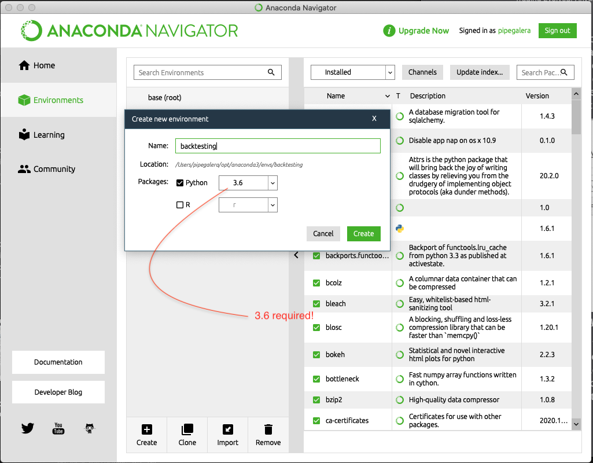
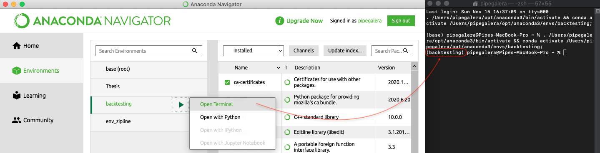
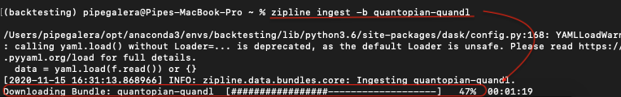
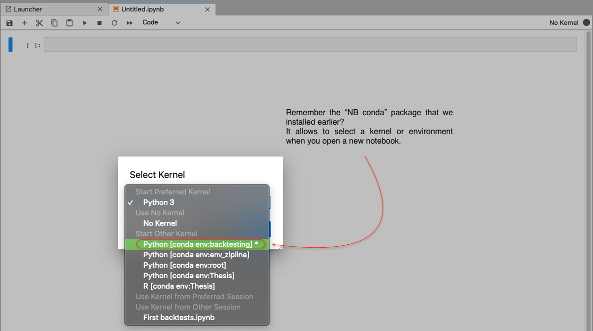
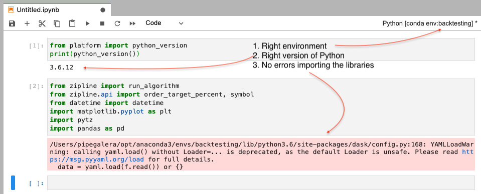

# What is backtesting?

In simple terms, backtesting is testing an investment strategy or model on historical data.

For example, let's say that have the conviction that when the price of Acme Corporation is above their historical mean, then the famous index Space & Peanuts 500 goes up. I would pseudocode the model or investment strategy into something like this:

```
If Acme_stock_price[today] > Acme_stock_price[yesterday]:
  Then buy $1000 in Space & Peanuts Index.
```

Before putting it into practice, I would like to know how good is the strategy by looking into the past data. What would have happened if, since 1970, every time Acme goes up I would have invested $1k in the Space & Peanuts's 500?

To test this strategy, or any real one, I have to set up a *backtesting environment*. In this post, I will go through the setup process, as I found that the tutorials online are outdated or not very detailed.

# Setting up the environment

I will explain how to install the libraries and packages necessary for doing backtesting.

## Step 1. Installing Conda.

Install Conda manually from: https://docs.conda.io/en/latest/miniconda.html

Conda is an environment manager. It allows to create and switch between the different virtual environments for different projects locally. Backtesting requires a very specific version of python, given that there are functions built on top of that version that wouldn't work otherwise. Also, is a good practice that every project has its own environment.

Inside Anaconda Navigator, go to the "Environments" tab, create a new one selecting Python 3.6. We are going to call it "backtesting".



The main library for backtesting that we will use, Zipline, require Python 2.7, 3.5, or 3.6 to work. However, they support newer versions over time. You can check the last version of Python supported at https://www.zipline.io/

For now, Python 3.6 is the newer Python version available.

## Step 2. Install packages.

Click on the play button and select open the terminal. It is important to make sure the terminal refers to this environment, as all the libraries that we will install will only be accessible by the "backtesting" environment.



First, make sure it is updated by running:

```python
conda update -n base -c defaults conda
```

Then, we need to install JupyterLab.
```python
conda install -c conda-forge jupyterlab
```

For the purposes of modeling trading strategies, I find the Jupyter Lab having the best of Jupyter Notebooks and superior to other visual IDEs like Spyder or Atom + Hydrogen.

Also matplotlib, one of the main visualization libraries in Python:
```python
conda install  matplotlib
```

Also, the datetime library. For timeseries, *datatime* is the easy way to manipulate dates and times.

```python
conda install -c conda-forge python-dateutil
```

One really useful tool to navigate between environments in jupyter lab or jupyter notebook is NB conda library, that you should install as well. You can also change enviroments using the terminal or other options inside Jupyter Lab, but it is just easier using NB conda.

```python
conda install -c conda-forge nb_conda_kernels
```

Install Pyfolio, an amazing tool to perform a quick risk analysis of the strategy:
```python
pip install pyfolio
```
Pyfolio is currently [not being updated by conda](https://anaconda.org/quantopian/pyfolio), so your only option at the moment to install the last version is using the global pip.

Finally, run the following to install Zipline, required to access the financial data:
```python
conda install -c conda-forge zipline
```

## Step 3. Getting financial data

In the previous steps, you have installed all the packages, but the financial data to evaluate the model is still missing. Financial data providers don't provide minute stock pricing for free because they are such kind of humans, they charge money for it. I will use a free data API called "quanld" or "quantopian-quanld". For zero-cost backtesting purposes, is an okay alternative.

The main problem with this API is that we can only run the backtest until Dec 2018. This situation will not be updated, as [Quantoian is closed](https://www.neudata.co/alternative-data-news/quantopian-shuts-its-doors-co-founders-join-robinhood), and quanld free API will be deprecated. Still, is an easy to use source and gets you ready to try algorithmic strategies in a local environment.

To have access to the data you have to create a free account at www.Quandl.com and find an API key in your account settings. To use the key you have to go to the terminal, make sure that you are in the "backtesting environment", and run:

```python
set QUANDL_API_KEY=the_key_of_your_account
```

P.S: "set" should be in lowercase, otherwise it doesn't work.

After you set the key, you are allowed to download (also called "ingest") the data by running:

```python
zipline ingest -b quantopian-quandl
```

If everything goes good, you will see that it starts to load the data:




You are done with the terminal.

## Step 4. Testing that everything works

Go to Anaconda Navigator and click on the Jupyter Lab application. It will pop up a tab in your web browser and you are ready to go. Create a new file and select the kernel "backtesting".




You can test if all the packages were installed and the data was loaded by running in one of the cells the python version and importing some of the packages. My computer runs a 3.7 Python version locally, so if the python version says 3.7 then is a clear sign that Jupyter Lab is not connecting with my 3.6 Python backtesting environment.




Besides a warning from a deprecated function, everything looks ready to go. It is normal to get these *deprecated warnings* as we are not using the latest version of Python. You are done with the prerequisites to run financial models locally.

In the next posts I will show very simple strategies and their performance. Thanks for reading!
