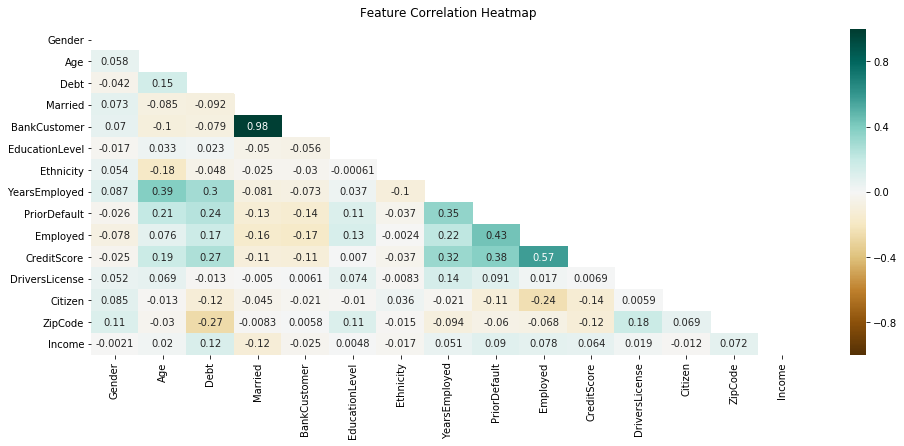
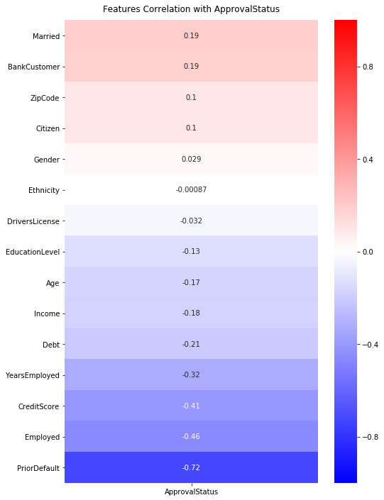

# Credit Card approval Prediction

# Structure

In the post I will go though the following steps:

1. Loading the data.
2. Cleaning it.
3. Preprocessing.
4. Basic data visualization.
5. Modeling: Baseline Logistic Regression
6. Modeling: GridSearchCV Logistic Regression

### Context

Credit score cards are a common risk control method in the financial industry. It uses personal information and data submitted by credit card applicants to predict the probability of future defaults and credit card borrowings. The bank is able to decide whether to issue a credit card to the applicant. Credit scores can objectively quantify the magnitude of risk.

### Data

<a href="http://archive.ics.uci.edu/ml/datasets/credit+approval">Credit Card Approval dataset</a> from the UCI Machine Learning Repository. The features of this dataset have been anonymized to protect the privacy, even the labels, but they should resemble the *probable features* in a typical credit card application:

- <code>Gender</code>
- <code>Age</code>
- <code>Debt</code>
- <code>Married</code>
- <code>BankCustomer</code>
- <code>EducationLevel</code>
- <code>Ethnicity</code>
- <code>YearsEmployed</code>
- <code>PriorDefault</code>
- <code>Employed</code>
- <code>CreditScore</code>
- <code>DriversLicense</code>
- <code>Citizen</code>
- <code>ZipCode</code>
- <code>Income</code>
- <code>ApprovalStatus</code>

### Task

Build a machine learning model to predict the probability of an applicant to get the credit card based on their background.


# 1. Loading the data


```python
import pandas as pd
import numpy as np
import pandas as pd

import matplotlib.pyplot as plt
import seaborn as sns
```


```python
credit = pd.read_csv("datasets/crx.data", header = None)
print(credit.shape)
credit.head(10)
```

    (690, 16)


<div>
<style scoped>
    .dataframe tbody tr th:only-of-type {
        vertical-align: middle;
    }

    .dataframe tbody tr th {
        vertical-align: top;
    }

    .dataframe thead th {
        text-align: right;
    }
</style>
<table border="0" class="dataframe">
  <thead>
    <tr style="text-align: right;">
      <th></th>
      <th>0</th>
      <th>1</th>
      <th>2</th>
      <th>3</th>
      <th>...</th>
      <th>12</th>
      <th>13</th>
      <th>14</th>
      <th>15</th>
    </tr>
  </thead>
  <tbody>
    <tr>
      <td>0</td>
      <td>b</td>
      <td>30.83</td>
      <td>0.000</td>
      <td>u</td>
      <td>...</td>
      <td>g</td>
      <td>00202</td>
      <td>0</td>
      <td>+</td>
    </tr>
    <tr>
      <td>1</td>
      <td>a</td>
      <td>58.67</td>
      <td>4.460</td>
      <td>u</td>
      <td>...</td>
      <td>g</td>
      <td>00043</td>
      <td>560</td>
      <td>+</td>
    </tr>
    <tr>
      <td>2</td>
      <td>a</td>
      <td>24.50</td>
      <td>0.500</td>
      <td>u</td>
      <td>...</td>
      <td>g</td>
      <td>00280</td>
      <td>824</td>
      <td>+</td>
    </tr>
    <tr>
      <td>3</td>
      <td>b</td>
      <td>27.83</td>
      <td>1.540</td>
      <td>u</td>
      <td>...</td>
      <td>g</td>
      <td>00100</td>
      <td>3</td>
      <td>+</td>
    </tr>
    <tr>
      <td>4</td>
      <td>b</td>
      <td>20.17</td>
      <td>5.625</td>
      <td>u</td>
      <td>...</td>
      <td>s</td>
      <td>00120</td>
      <td>0</td>
      <td>+</td>
    </tr>
    <tr>
      <td>5</td>
      <td>b</td>
      <td>32.08</td>
      <td>4.000</td>
      <td>u</td>
      <td>...</td>
      <td>g</td>
      <td>00360</td>
      <td>0</td>
      <td>+</td>
    </tr>
    <tr>
      <td>6</td>
      <td>b</td>
      <td>33.17</td>
      <td>1.040</td>
      <td>u</td>
      <td>...</td>
      <td>g</td>
      <td>00164</td>
      <td>31285</td>
      <td>+</td>
    </tr>
    <tr>
      <td>7</td>
      <td>a</td>
      <td>22.92</td>
      <td>11.585</td>
      <td>u</td>
      <td>...</td>
      <td>g</td>
      <td>00080</td>
      <td>1349</td>
      <td>+</td>
    </tr>
    <tr>
      <td>8</td>
      <td>b</td>
      <td>54.42</td>
      <td>0.500</td>
      <td>y</td>
      <td>...</td>
      <td>g</td>
      <td>00180</td>
      <td>314</td>
      <td>+</td>
    </tr>
    <tr>
      <td>9</td>
      <td>b</td>
      <td>42.50</td>
      <td>4.915</td>
      <td>y</td>
      <td>...</td>
      <td>g</td>
      <td>00052</td>
      <td>1442</td>
      <td>+</td>
    </tr>
  </tbody>
</table>
<p>10 rows × 16 columns</p>
</div>


```python
credit.dtypes
```


    0      object
    1      object
    2     float64
    3      object
    4      object
    5      object
    6      object
    7     float64
    8      object
    9      object
    10      int64
    11     object
    12     object
    13     object
    14      int64
    15     object
    dtype: object


```python
credit.isnull().values.sum()
```


    0


The dataset is not clean. For example, column 1 has an object type but clearly the values are numerical. Since we only have 16 columns, we can have a glance at every column to see what we should be looking for in the cleaning phase using a loop.

The loop prints the first 20 unique elements of every column.


```python
for i in range(0,len(credit.columns)): print(credit[i].unique()[:20])
```

    ['b' 'a' '?']
    ['30.83' '58.67' '24.50' '27.83' '20.17' '32.08' '33.17' '22.92' '54.42'
     '42.50' '22.08' '29.92' '38.25' '48.08' '45.83' '36.67' '28.25' '23.25'
     '21.83' '19.17']
    [ 0.     4.46   0.5    1.54   5.625  4.     1.04  11.585  4.915  0.83
      1.835  6.     6.04  10.5    4.415  0.875  5.875  0.25   8.585 11.25 ]
    ['u' 'y' '?' 'l']
    ['g' 'p' '?' 'gg']
    ['w' 'q' 'm' 'r' 'cc' 'k' 'c' 'd' 'x' 'i' 'e' 'aa' 'ff' 'j' '?']
    ['v' 'h' 'bb' 'ff' 'j' 'z' '?' 'o' 'dd' 'n']
    [1.25  3.04  1.5   3.75  1.71  2.5   6.5   0.04  3.96  3.165 2.165 4.335
     1.    5.    0.25  0.96  3.17  0.665 0.75  0.835]
    ['t' 'f']
    ['t' 'f']
    [ 1  6  0  5  7 10  3 17  2  9  8 15 11 12 40 23  4 20 67 14]
    ['f' 't']
    ['g' 's' 'p']
    ['00202' '00043' '00280' '00100' '00120' '00360' '00164' '00080' '00180'
     '00052' '00128' '00260' '00000' '00320' '00396' '00096' '00200' '00300'
     '00145' '00500']
    [    0   560   824     3 31285  1349   314  1442   200  2690   245  1208
      1260    11 10000  5000  4000    35   713   551]
    ['+' '-']


Apparently, the symbol ? is missing values.

# 2. Cleaning the data


```python
# Change column names
column_names = [
"Gender",
"Age",
"Debt",
"Married",
"BankCustomer",
"EducationLevel",
"Ethnicity",
"YearsEmployed",
"PriorDefault",
"Employed",
"CreditScore",
"DriversLicense",
"Citizen",
"ZipCode",
"Income",
"ApprovalStatus"]

credit.columns = column_names
```


```python
# Correct format for missing values
credit = credit.replace("?", np.nan)
```


```python
# Check categorical and numerical columns have the proper format. Most are categories.
credit.dtypes
```


    Gender             object
    Age                object
    Debt              float64
    Married            object
    BankCustomer       object
    EducationLevel     object
    Ethnicity          object
    YearsEmployed     float64
    PriorDefault       object
    Employed           object
    CreditScore         int64
    DriversLicense     object
    Citizen            object
    ZipCode            object
    Income              int64
    ApprovalStatus     object
    dtype: object


```python
# Replace ? with correct label
credit = credit.replace("?", np.nan)
# Missing values by column
print(credit.isnull().sum())
# Total missing values after inputation
print("Total missing values:", credit.isnull().values.sum())
```

    Gender            12
    Age               12
    Debt               0
    Married            6
    BankCustomer       6
    EducationLevel     9
    Ethnicity          9
    YearsEmployed      0
    PriorDefault       0
    Employed           0
    CreditScore        0
    DriversLicense     0
    Citizen            0
    ZipCode           13
    Income             0
    ApprovalStatus     0
    dtype: int64
    Total missing values: 67


To fill the rest of the missing data depending on the type of the column we create a "fillnan" function that will fill the "nans" values with the mean of the values of the column if its numerical, and with the most usual value if the column is categorical.


```python
# Only display 8 columns, not the 15.
pd.set_option('display.max_columns', 8)
```


```python
def fillnans(dataset):
    """
    For every column in the dataset:
    - If it's numerical fill with the mean.
    - If it's categorical fill with the most usual value.
    """
    for i in dataset.columns:
        if dataset[i].dtypes == 'float64':
            dataset.fillna(dataset.mean(), inplace = True)
        if dataset[i].dtypes == 'int64':
            dataset.fillna(dataset.mean(), inplace = True)
        if dataset[i].dtypes == 'object':
            dataset[i].fillna(dataset[i].value_counts().index[0], inplace = True)

    return dataset

```


```python
fillnans(credit)
```


<div>
<style scoped>
    .dataframe tbody tr th:only-of-type {
        vertical-align: middle;
    }

    .dataframe tbody tr th {
        vertical-align: top;
    }

    .dataframe thead th {
        text-align: right;
    }
</style>
<table border="0" class="dataframe">
  <thead>
    <tr style="text-align: right;">
      <th></th>
      <th>Gender</th>
      <th>Age</th>
      <th>Debt</th>
      <th>Married</th>
      <th>...</th>
      <th>Citizen</th>
      <th>ZipCode</th>
      <th>Income</th>
      <th>ApprovalStatus</th>
    </tr>
  </thead>
  <tbody>
    <tr>
      <td>0</td>
      <td>b</td>
      <td>30.83</td>
      <td>0.000</td>
      <td>u</td>
      <td>...</td>
      <td>g</td>
      <td>00202</td>
      <td>0</td>
      <td>+</td>
    </tr>
    <tr>
      <td>1</td>
      <td>a</td>
      <td>58.67</td>
      <td>4.460</td>
      <td>u</td>
      <td>...</td>
      <td>g</td>
      <td>00043</td>
      <td>560</td>
      <td>+</td>
    </tr>
    <tr>
      <td>2</td>
      <td>a</td>
      <td>24.50</td>
      <td>0.500</td>
      <td>u</td>
      <td>...</td>
      <td>g</td>
      <td>00280</td>
      <td>824</td>
      <td>+</td>
    </tr>
    <tr>
      <td>3</td>
      <td>b</td>
      <td>27.83</td>
      <td>1.540</td>
      <td>u</td>
      <td>...</td>
      <td>g</td>
      <td>00100</td>
      <td>3</td>
      <td>+</td>
    </tr>
    <tr>
      <td>4</td>
      <td>b</td>
      <td>20.17</td>
      <td>5.625</td>
      <td>u</td>
      <td>...</td>
      <td>s</td>
      <td>00120</td>
      <td>0</td>
      <td>+</td>
    </tr>
    <tr>
      <td>...</td>
      <td>...</td>
      <td>...</td>
      <td>...</td>
      <td>...</td>
      <td>...</td>
      <td>...</td>
      <td>...</td>
      <td>...</td>
      <td>...</td>
    </tr>
    <tr>
      <td>685</td>
      <td>b</td>
      <td>21.08</td>
      <td>10.085</td>
      <td>y</td>
      <td>...</td>
      <td>g</td>
      <td>00260</td>
      <td>0</td>
      <td>-</td>
    </tr>
    <tr>
      <td>686</td>
      <td>a</td>
      <td>22.67</td>
      <td>0.750</td>
      <td>u</td>
      <td>...</td>
      <td>g</td>
      <td>00200</td>
      <td>394</td>
      <td>-</td>
    </tr>
    <tr>
      <td>687</td>
      <td>a</td>
      <td>25.25</td>
      <td>13.500</td>
      <td>y</td>
      <td>...</td>
      <td>g</td>
      <td>00200</td>
      <td>1</td>
      <td>-</td>
    </tr>
    <tr>
      <td>688</td>
      <td>b</td>
      <td>17.92</td>
      <td>0.205</td>
      <td>u</td>
      <td>...</td>
      <td>g</td>
      <td>00280</td>
      <td>750</td>
      <td>-</td>
    </tr>
    <tr>
      <td>689</td>
      <td>b</td>
      <td>35.00</td>
      <td>3.375</td>
      <td>u</td>
      <td>...</td>
      <td>g</td>
      <td>00000</td>
      <td>0</td>
      <td>-</td>
    </tr>
  </tbody>
</table>
<p>690 rows × 16 columns</p>
</div>


```python
print("Total missing values after fillnans:", credit.isnull().values.sum())
```

    Total missing values after fillnans: 0


# 3. Preprocesing

Most of the algorithms are picky with the format of your data. They have to be numerical. I will use sklearn label encoder to "hot encode" the categories: simply label every category (a,b,u,g,v...) in the object columns with a different integer.


```python
print("Before the preprocessing, the data values looks like this:")
credit.head()
```

    Before the preprocessing, the data values looks like this:


<div>
<style scoped>
    .dataframe tbody tr th:only-of-type {
        vertical-align: middle;
    }

    .dataframe tbody tr th {
        vertical-align: top;
    }

    .dataframe thead th {
        text-align: right;
    }
</style>
<table border="0" class="dataframe">
  <thead>
    <tr style="text-align: right;">
      <th></th>
      <th>Gender</th>
      <th>Age</th>
      <th>Debt</th>
      <th>Married</th>
      <th>...</th>
      <th>Citizen</th>
      <th>ZipCode</th>
      <th>Income</th>
      <th>ApprovalStatus</th>
    </tr>
  </thead>
  <tbody>
    <tr>
      <td>0</td>
      <td>b</td>
      <td>30.83</td>
      <td>0.000</td>
      <td>u</td>
      <td>...</td>
      <td>g</td>
      <td>00202</td>
      <td>0</td>
      <td>+</td>
    </tr>
    <tr>
      <td>1</td>
      <td>a</td>
      <td>58.67</td>
      <td>4.460</td>
      <td>u</td>
      <td>...</td>
      <td>g</td>
      <td>00043</td>
      <td>560</td>
      <td>+</td>
    </tr>
    <tr>
      <td>2</td>
      <td>a</td>
      <td>24.50</td>
      <td>0.500</td>
      <td>u</td>
      <td>...</td>
      <td>g</td>
      <td>00280</td>
      <td>824</td>
      <td>+</td>
    </tr>
    <tr>
      <td>3</td>
      <td>b</td>
      <td>27.83</td>
      <td>1.540</td>
      <td>u</td>
      <td>...</td>
      <td>g</td>
      <td>00100</td>
      <td>3</td>
      <td>+</td>
    </tr>
    <tr>
      <td>4</td>
      <td>b</td>
      <td>20.17</td>
      <td>5.625</td>
      <td>u</td>
      <td>...</td>
      <td>s</td>
      <td>00120</td>
      <td>0</td>
      <td>+</td>
    </tr>
  </tbody>
</table>
<p>5 rows × 16 columns</p>
</div>


```python
def objectransform(dataset):
    # Import encoder
    from sklearn import preprocessing
    le = preprocessing.LabelEncoder()
    # Apply encoder to object columns
    for i in dataset.columns:
        if dataset[i].dtypes == 'object':
            dataset[i] = le.fit_transform(dataset[i])

    return dataset
```


```python
objectransform(credit)
```


<div>
<style scoped>
    .dataframe tbody tr th:only-of-type {
        vertical-align: middle;
    }

    .dataframe tbody tr th {
        vertical-align: top;
    }

    .dataframe thead th {
        text-align: right;
    }
</style>
<table border="0" class="dataframe">
  <thead>
    <tr style="text-align: right;">
      <th></th>
      <th>Gender</th>
      <th>Age</th>
      <th>Debt</th>
      <th>Married</th>
      <th>...</th>
      <th>Citizen</th>
      <th>ZipCode</th>
      <th>Income</th>
      <th>ApprovalStatus</th>
    </tr>
  </thead>
  <tbody>
    <tr>
      <td>0</td>
      <td>1</td>
      <td>156</td>
      <td>0.000</td>
      <td>1</td>
      <td>...</td>
      <td>0</td>
      <td>68</td>
      <td>0</td>
      <td>0</td>
    </tr>
    <tr>
      <td>1</td>
      <td>0</td>
      <td>328</td>
      <td>4.460</td>
      <td>1</td>
      <td>...</td>
      <td>0</td>
      <td>11</td>
      <td>560</td>
      <td>0</td>
    </tr>
    <tr>
      <td>2</td>
      <td>0</td>
      <td>89</td>
      <td>0.500</td>
      <td>1</td>
      <td>...</td>
      <td>0</td>
      <td>96</td>
      <td>824</td>
      <td>0</td>
    </tr>
    <tr>
      <td>3</td>
      <td>1</td>
      <td>125</td>
      <td>1.540</td>
      <td>1</td>
      <td>...</td>
      <td>0</td>
      <td>31</td>
      <td>3</td>
      <td>0</td>
    </tr>
    <tr>
      <td>4</td>
      <td>1</td>
      <td>43</td>
      <td>5.625</td>
      <td>1</td>
      <td>...</td>
      <td>2</td>
      <td>37</td>
      <td>0</td>
      <td>0</td>
    </tr>
    <tr>
      <td>...</td>
      <td>...</td>
      <td>...</td>
      <td>...</td>
      <td>...</td>
      <td>...</td>
      <td>...</td>
      <td>...</td>
      <td>...</td>
      <td>...</td>
    </tr>
    <tr>
      <td>685</td>
      <td>1</td>
      <td>52</td>
      <td>10.085</td>
      <td>2</td>
      <td>...</td>
      <td>0</td>
      <td>90</td>
      <td>0</td>
      <td>1</td>
    </tr>
    <tr>
      <td>686</td>
      <td>0</td>
      <td>71</td>
      <td>0.750</td>
      <td>1</td>
      <td>...</td>
      <td>0</td>
      <td>67</td>
      <td>394</td>
      <td>1</td>
    </tr>
    <tr>
      <td>687</td>
      <td>0</td>
      <td>97</td>
      <td>13.500</td>
      <td>2</td>
      <td>...</td>
      <td>0</td>
      <td>67</td>
      <td>1</td>
      <td>1</td>
    </tr>
    <tr>
      <td>688</td>
      <td>1</td>
      <td>20</td>
      <td>0.205</td>
      <td>1</td>
      <td>...</td>
      <td>0</td>
      <td>96</td>
      <td>750</td>
      <td>1</td>
    </tr>
    <tr>
      <td>689</td>
      <td>1</td>
      <td>197</td>
      <td>3.375</td>
      <td>1</td>
      <td>...</td>
      <td>0</td>
      <td>0</td>
      <td>0</td>
      <td>1</td>
    </tr>
  </tbody>
</table>
<p>690 rows × 16 columns</p>
</div>


After the hot encoding, every different category inside every column is transformed into an integer.

# 4. Basic Data Visualization


```python
def heatmap(dataset):
    """
    It assumes that the target is in the last column
    """
    # Features only
    features_corr = dataset.iloc[:,0:-1].corr()
    # Heatmap
    plt.figure(figsize=(16, 6))
    mask = np.triu(np.ones_like(features_corr, dtype=np.bool))
    heatmap = sns.heatmap(features_corr,
                          mask = mask,
                          vmin=-1, vmax=1,
                          annot=True,
                          cmap='BrBG')

    heatmap.set_title('Feature Correlation Heatmap', fontdict={'fontsize':12}, pad=12);

```


```python
heatmap(credit)
```





```python
def heatmap_target(dataset):
    """
    It assumes that the target is in the last column
    """
    # Correlation with the target, sorted from more to less correlation
    corr = dataset.corr().iloc[:, -1].sort_values(ascending=False)
    # Correct the shape
    corr = pd.DataFrame(corr).iloc[1:,:]
    # Heatmap ranking
    plt.figure(figsize=(8, 12))

    heatmap = sns.heatmap(corr,
                          vmin=-1, vmax=1,
                          annot=True,
                          cmap='bwr')

    heatmap.set_title('Features Correlation with {}'.format(credit.columns[-1]),
                      fontdict={'fontsize':12}, pad=12);
```


```python
heatmap_target(credit)
```





# 5. Modeling: Baseline Logistic Regression

We have to change the DataFrames to arrays to be able to run the algorithms. We will use all the 15 features (X) to predict credit card approval (y).


```python
# Dataframe in values format
credit_values = credit.values
print(credit.shape)
# Columns 0 to 14 are features and 15 the target
X, y = credit_values[:, 0:14], credit_values[:, -1]
```

    (690, 16)


A basiline model has 2 main premises:

    1. Should be simple (less likely to overfit).
    2. Should be interpretable (explainability will help for next models)

I will start with a simple linear Logistic Regression model rescaling features.

Why I use linear logistic regression?

    1. Our target variable (credit card approval) is binary.

    2. Linearity is most of the time the best approximation of the conditional expectation function.

    That is, if there is a relation between the features and the target, it most likely to be linear, and it does a good job predicting the expected value of the target conditional to their features attached.

    For example, the expected credit card approval conditional or being married, being 35 years old, and a low credit score.

    3. The results are interpretable. For example, using the results we can calculate how being a bank customer or your gender increases or decreases your probability of getting a credit card approved.


Why I rescale the features?

    1. Without rescaling, the model does not converge.

    2. It makes sense. The features are in different units (years education level, dollars of income, types of gender, credit scores...). With linear rescaling they are under the same range units. In this case, all the values are scaled to be in between 0 and 1.


The metric chosen is accuracy, defined as:

$$\text{Accuracy} = \frac{\text{Number of correct predictions}}{\text{Total number of predictions}}$$

Accuracy alone doesn't tell the full story when you're working with a class-imbalanced data set. For example, if all the credit card approval was rejected, then predicting always credit card denied would hold a 100% accuracy. However, our data is not imbalanced, with around 56% of card application rejected and 44% accepted:


```python
credit["ApprovalStatus"].value_counts()
```


    1    383
    0    307
    Name: ApprovalStatus, dtype: int64


Baseline regression. We run the first logistic regression scaled, using 2/3 of the labeled data to train the model and testing if it can predict the label of the resting 1/3:


```python
def run_logreg(test_size):
    # Split into train and test sets
    from sklearn.model_selection import train_test_split
    # Split into train and test sets
    X_train, X_test, y_train, y_test = train_test_split(X, y,
                                                    test_size= test_size,
                                                    random_state= 1234)


    # Scale the features
    from sklearn.preprocessing import MinMaxScaler
    scaler = MinMaxScaler(feature_range = (0,1))
    X_train_res = scaler.fit_transform(X_train)
    X_test_res = scaler.fit_transform(X_test)

    # Logistic regression
    from sklearn.linear_model import LogisticRegression

    ## Train the model
    logreg = LogisticRegression()
    logreg.fit(X_train_res, y_train)

    ## Test the model
    y_pred = logreg.predict(X_test_res)
    print("Accuracy with {}% of test data".format(round(test_size*100,0)), "=",
          logreg.score(X_test_res, y_test))

```


```python
run_logreg(1/3)
```

    Accuracy with 33.0% of test data = 0.8260869565217391


The algorithm is able to predict the approval or rejection of a credit card applicant only looking at their characteristics with 82.6% accuracy. Of the 228 credit profiles for the model to be tested (2/3 or the total 690 cases), it predicted correctly the approval or rejection of 187 cases (82.6% of 228).

We can play around with different proportions of train and test data to explore the case of overfitting (also referred to as *trade-off between variance and bias*):


```python
for test_size in [0.05,0.1,0.2,0.3,0.4,0.5,0.6,0.7,0.8]:
    run_logreg(test_size)
```

    Accuracy with 5.0% of test data = 0.9142857142857143
    Accuracy with 10.0% of test data = 0.8840579710144928
    Accuracy with 20.0% of test data = 0.8695652173913043
    Accuracy with 30.0% of test data = 0.8309178743961353
    Accuracy with 40.0% of test data = 0.855072463768116
    Accuracy with 50.0% of test data = 0.8405797101449275
    Accuracy with 60.0% of test data = 0.8478260869565217
    Accuracy with 70.0% of test data = 0.8426501035196687
    Accuracy with 80.0% of test data = 0.8351449275362319

In the test above, the logistic regression is 8% more precise splitting 5% of test data and 95% of train data than using 80% of test data and 20% of train data.

The more the test size, the fewer train data the algorithm has to be able to "learn" the patterns that lead to the target. Therefore, is less accurate in predicting the fed data.

Despite that, the cost of using most of the data to train the model in small datasets like this one is that it overfits the model and it performs worse predicting new data. It learns so well the patterns of the current data that, when you introduce new data with some variations in the features, the algorithm does not know how to classify it well.

We will deal with overfitting by performing a GridSearch that uses a different approach to split the data.

# 6. Modeling: GridSearchCV Logistic Regression

Instead of setting a fixed and unique split between the train and the test sample, the cross-validation algorithm will do the split k times, applying the logistic regressions and the accuracy in every split.

The average accuracy of the k tries will be the 'total' model accuracy.

This method prevents overfitting because there is always a different blind proportion of the data that the algorithm does not use for training. Every split, different data points for training and test set, introducing feature variations.

We also will perform a little bit of "tuning" proposing several hyperparameters values that the algorithm can choose from and pick the best ones.

Visual representation of every split/iteration. The dots are data points and the red and green colors are the labels. In the image, we can see 4 iterations or splits with the same 1-to-4 proportion of test-to-train (5 dots test, 15 dots train).


```python
def run_logreg(n_splits):
    # Scale the training set
    from sklearn.preprocessing import MinMaxScaler
    scaler = MinMaxScaler(feature_range = (0,1))
    X_res = scaler.fit_transform(X)


    # Params to tune
    params = {
        'tol': [0.01, 0.001, 0.0001],
        'max_iter': [100,150,200],
        'C': [0.001,0.01,0.1,1,10,100,1000]}

    # Grid search CV model
    from sklearn.linear_model import LogisticRegression
    from sklearn.model_selection import GridSearchCV

    # Train model
    grid_logreg = GridSearchCV(estimator = LogisticRegression(),
                               param_grid = params,
                               cv = n_splits)
    grid_logreg_fit = grid_logreg.fit(X_res, y)

    ## Test model
    best_score  = grid_logreg.best_score_
    best_params = grid_logreg_fit.best_params_

    print("Accuracy with {} splits".format(n_splits), "=", best_score,
          "using:", best_params )
```


```python
for n_splits in [2,5,10,20]:
    run_logreg(n_splits)
```

    Accuracy with 2 splits = 0.8565217391304347 using: {'C': 1, 'max_iter': 100, 'tol': 0.01}
    Accuracy with 5 splits = 0.8492753623188405 using: {'C': 1, 'max_iter': 100, 'tol': 0.01}
    Accuracy with 10 splits = 0.8478260869565217 using: {'C': 0.1, 'max_iter': 100, 'tol': 0.01}
    Accuracy with 20 splits = 0.8523949579831933 using: {'C': 1, 'max_iter': 100, 'tol': 0.01}


It doesn't really matter how many splits it does with cross-validation in this small toy-dataset, as the algorithm quickly finds a pattern to predict the target. In any case, it is considered good practice to explore different split values in more difficult datasets with fewer features and less clear boundaries between good and bad credit card customers.

Overall we have a model with around 85% accuracy avoiding overfitting. Thanks for reading! Find the link to the repository with the notebook [here](https://github.com/pipegalera/starter-academic/blob/master/content/post/credit-card-approval/credit_card_approval.ipynb).
