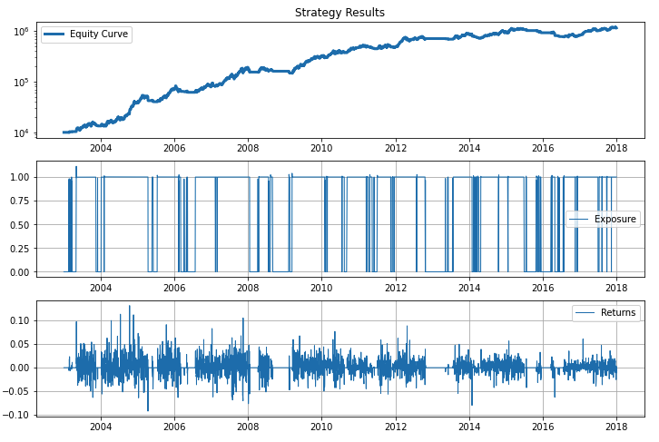

## Requirements

1. Having a backtesting local environment with *Zipline* and the basic packages installed (Pyfolio, Matplotlib, datetime...). If not, please check this [post](https://www.pipegalera.com/post/bracktesting-setup/).

2. Have some previous experience with python, specially with the numpy and pandas packages. The post can be followed anyway because is rather a toy-example, but you would have to know data manipulation to implement your own strategy.

## Your first Zipline Backtest

I will explain the basic structure of backtesting a trading algorithm in *zipline*. If you are use to use Python, you will se that *zipline* works different from other packages. The main difference is that you will have methods that only works inside of predifined functions. This is true for the way it loads the data and apply the strategy, but you can analyze or visualize the results the way you like it with your own functions.

In any case, the package is really well done and most of the methods and operations that you can think about are already made by the Quantopian team. In the [documentation site](https://www.zipline.io/appendix.html) they post the entire list of methods and functions in dept.

## Why this is a toy-example?

1. We have not included trading costs.
2. Not incluede slippage, viability, diversification, or risk managment.
3. Random backtesting start in 2003.
4. Survival bias. Some of the companies go out and in the index. Only good companies survived in the index from 2003 to 2018, and therefore the results are very likelly to be profitable no matter the strategy.

## Why you should read it anyway?

While is basic, the backbones are still the same for more complex strategies. Need to account for trading costs? Use the method *set_commission()*. Slippage? Use *set_slippage()*. Control diversification and exposure? Create a list of tickers with different firms in different industries and use *order_target_percent()*. You would only have to introduce the methods with a few lines of code but the structure would remain the same.

The basic structure is the following:

## 1. Initialize the strategy.

Before the start of the algorithm, *zipline* calls the *initialize()* function and passes in a *context* variable. *context* is a persistent namespace for you to store variables you need to access from one algorithm iteration to the next.

```python
    def initialize(context):
        context.stock = symbol("AAPL")
        context.index_average_window = 100
```

In this case, the stocks (Apple) and the trading days (100) will be fixed into the context variable.

## 2. Handle data.

After the algorithm has been initialized, *zipline* calls the *handle_data()* function once for each event. At every call, it passes the same *context* variable and an event-frame called *data*
```python
    def handle_data(context, data):
        equities_hist = data.history(context.stock,
                                    "close",
                                     context.index_average_window,
                                    "1d")

        # Check price is above moving average
        if equities_hist[-1] > equities_hist.mean():
            stock_weight = 1
        else:
            stock_weight = 0

        order_target_percent(context.stock, stock_weight)
```

We will take the closing price of Apple stock (context.stock). With a daily frequency, considering the last 100 days to calculate the moving average (context.index_average_window).

For every day we will apply the next strategy: If the value of the stock is higher than the moving average, hold (buy) all the stock posible. Otherwise flat (sell).

Lastly, the *order_target_percent(context.stock, target)* function place the order calling the stock and the desired pertange of the portfolio to allocate. For this simple strategy, is hold all (100% exposure) or sell all stocks (0%).

## 3. Analyze the strategy.

For every backtest, *initialize* and *handle data* are necessary. At this point the backtest is done, this function is called once at the end of the backtestand. *analyze* calls the context and a *DataFrame* of the performance data.

Analyze is used to visualize the trading algorithm behavior. The backtesting generates a dataframe with several metrics to evaluate the strategy. The *plot* argumnet refers to this dataframe, and we will visualize specifically the columns *portfolio_value*, *gross_leverage* and *returns*.

```python
    def analyze(context, plot):
        fig = plt.figure(figsize = (12, 8))

        # First chart
        ax = fig.add_subplot(311)
        ax.set_title("Strategy Results")
        ax.semilogy(plot["portfolio_value"],
                    linestyle = "-",
                    label = "Equity Curve",
                    linewidth = 3)
        ax.legend()
        ax.grid(False)

        # Second chart
        ax = fig.add_subplot(312)
        ax.plot(plot["gross_leverage"],
                label = "Exposure",
                linestyle = "-",
                linewidth = 1)
        ax.legend()
        ax.grid(True)

        # Third chart
        ax = fig.add_subplot(313)
        ax.plot(plot["returns"],
                label = "Returns",
                linestyle = "-",
                linewidth = 1)
        ax.legend()
        ax.grid(True)
```

## 4. Fire off the backtest.

The last step is choosing the time period of the analysis (2003 to 2020) and setting the initial capital to start with ($10000). The function *run_algorithm* runs the trading algorithm calling the previous *initialize*, *handle_data* and *analyze*.

```python
    start_date = pd.Timestamp('2003-1-1', tz='utc')
    end_date = pd.Timestamp('2019-12-31', tz='utc')

    results = run_algorithm(start = start_date,
                            end = end_date,
                            initialize = initialize,
                            handle_data = handle_data,
                            analyze = analyze,
                            capital_base = 10000)
```

## Let's run everything!

```python
from zipline import run_algorithm
from zipline.api import order_target_percent, symbol
from datetime import datetime
import matplotlib.pyplot as plt
import pytz
import pandas as pd

# silence warnings
import warnings
warnings.filterwarnings('ignore')

```

```python
def initialize(context):
    context.stock = symbol("AAPL")
    context.index_average_window = 100

def handle_data(context, data):
    equities_hist = data.history(context.stock,
                                "close",
                                context.index_average_window,
                                "1d")

    # Check price is above moving average
    if equities_hist[-1] > equities_hist.mean():
        stock_weight = 1
    else:
        stock_weight = 0

    order_target_percent(context.stock, stock_weight)

def analyze(context, plot):
    fig = plt.figure(figsize = (12, 8))

    # First chart
    ax = fig.add_subplot(311)
    ax.set_title("Strategy Results")
    ax.semilogy(plot["portfolio_value"],
                linestyle = "-",
                label = "Equity Curve",
                linewidth = 3)
    ax.legend()
    ax.grid(False)

    # Second chart
    ax = fig.add_subplot(312)
    ax.plot(plot["gross_leverage"],
            label = "Exposure",
            linestyle = "-",
            linewidth = 1)
    ax.legend()
    ax.grid(True)

    # Third chart
    ax = fig.add_subplot(313)
    ax.plot(plot["returns"],
            label = "Returns",
            linestyle = "-",
            linewidth = 1)
    ax.legend()
    ax.grid(True)

# Fire off the backtest
start_date = pd.Timestamp('2003-1-1', tz='utc')
end_date = pd.Timestamp('2019-12-31', tz='utc')

results = run_algorithm(start = start_date,
                        end = end_date,
                        initialize = initialize,
                        handle_data = handle_data,
                        analyze = analyze,
                        capital_base = 10000,
                        data_frequency = 'daily')
```

When it finish loading, you should see some basic analysis similar to this ones popping up below:



### What's showing the "Equity Curve" graph?

The Y-axis is the change in the value of the portfolio, and the X-axis is the time. Logicaly, if the curve is upwards it shows positive returns over time. An initial investment in Apple of $10.000 in 2003 would be multiplied by ten by 2018 following the strategy.

A straight up equity curve like this one is an unicorn. We have choosen Apple stocks, of course the portfolio would grow if we would hold Apple from 2003!

### What's showing the "Exposure" graph?

The Y-axis shows the percentage of the portfolio invested in the security, 1 represents a hundred percent and 0, zero percent.

For this basic strategy, it only jumps from 1 to 0 and viceversa because the algo strategy sells or buy **all** Apple stock depending on the daily price in relation with its moving average:

```python
    if equities_hist[-1] > equities_hist.mean():
        stock_weight = 1
    else:
        stock_weight = 0
```
You can see in the graph, for example, that during most of 2005 we continuously hold the stock(100%), as Apple started taking off.

### What's showing the "Returns" graph?

This one is the most self explanatory. The vertinal axis represents the **daily** returns in percentages over time, in the horizontal axis. This a usual line plot, just with lots of day returns in a rather small X-axis. There are about 252 trades from one year to the next (one for every traiding day), making the graph a little tigh.

## Fin

Enough for a first backtest! From here, you have plenty of options on how to slice, dice and display the data, apply benchmarks and so, that I will explore in future post.

Find the link to the repository with the notebook [here](https://github.com/pipegalera/starter-academic/blob/master/content/post/test-algo-strategy/first_backtests.ipynb).
